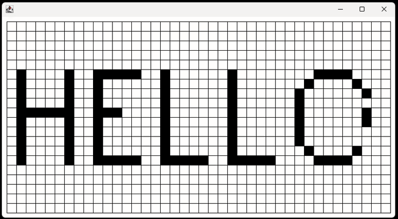

# 🎨 Grid Painter 🎨

Grid Painter is a Java project developed during the 5th week of my Java bootcamp.
The game consists of an interactive grid where you can paint squares, remove the paint, and save or load your progress to continue later.
It allows users to have full control over the grid and the painting, offering a creative and customizable experience.

## Features

- Paint squares on the grid (Move with arrows and press SpaceBar to paint a square)
- Remove the paint from squares (Press SpaceBar in a painted square)
- Clear all painted squares (Key: C)
- Save your current painting (Key: S)
- Load a previously saved painting to continue (Key: L)

## Technologies Used

- Java
- Simple Graphics lib

## Project Demo 🎨

Hope you like! 
